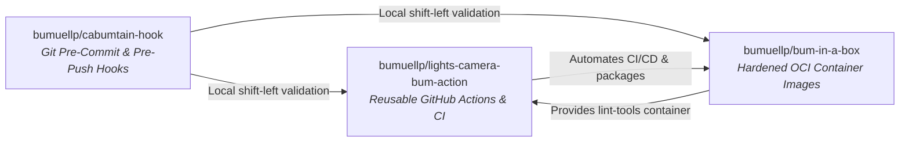

> 🔗 **Related**: [Architecture: Container Images (bum-in-a-box)](./bum-in-a-box-explanation.md) · [Architecture: Actions Suite (lights-camera-bum-action)](./lights-camera-bum-action-explanation.md) · [Architecture: Git Hooks (cabumtain-hook)](./cabumtain-hook-explanation.md)

The open-source tooling ecosystem consists of three complementary building blocks designed to automate DevOps, Git quality gates, and container delivery:

---

## 🏗️ The Repository Triad

| Repository                              | Responsibility                                                                                                                        | Canonical Resource                                                                      |
| :-------------------------------------- | :------------------------------------------------------------------------------------------------------------------------------------ | :-------------------------------------------------------------------------------------- |
| **`bumuellp/cabumtain-hook`**           | Modular Git hooks: Conventional Commits, Tag Immutability, local `act` integration testing, Trivy security scans.                     | [cabumtain-hook GitHub](https://github.com/bumuellp/cabumtain-hook)                     |
| **`bumuellp/lights-camera-bum-action`** | 9 reusable GitHub Actions: containerized `pre-commit`, SemVer `bump-version`, GHCR retention `cleanup-ghcr-packages`, Buildx builder. | [lights-camera-bum-action GitHub](https://github.com/bumuellp/lights-camera-bum-action) |
| **`bumuellp/bum-in-a-box`**             | Curated container images: `lint-tools`, `llama-proxy` (Vulkan + ktransforms), `mcpo`, `openclaw`, `vibe-trading`.                     | [bum-in-a-box GitHub](https://github.com/bumuellp/bum-in-a-box)                         |

---

## 🛡️ Testing Pyramid Standard

Across all three repositories, quality is enforced at three distinct levels:

1. **Level 1: Static Analysis & Formatters**:
   - Runs locally on `git commit` and in CI.
   - Enforces `yamllint`, `shellcheck`, and `check-jsonschema` (validating action and workflow YAML manifests against official schemas).

2. **Level 2: Unit & Behavioral Testing**:
   - Fast `pytest` suites run via `python-tests.sh` hook.
   - Tests command argument generation, error handling, exit code propagation, and failure modes with mocked dependencies.

3. **Level 3: Integration & Smoke Testing**:
   - **Actions**: Tested via GitHub Actions composite self-tests (`.github/workflows/integration-tests.yml`), runnable both in CI and locally via `act`.
   - **Containers**: Smoke tested via `scripts/smoke-test.sh` verifying non-root execution (`UID != 0`) and binary functionality before publishing to GHCR.

---

## 🔗 Related Documentation & Context

- [Architecture: Container Images (bum-in-a-box)](./bum-in-a-box-explanation.md)
- [Architecture: Actions Suite (lights-camera-bum-action)](./lights-camera-bum-action-explanation.md)
- [Architecture: Git Hooks (cabumtain-hook)](./cabumtain-hook-explanation.md)
- [Cheat Sheet: Pre-Commit Framework](../tools/pre-commit-cheatsheet.md)
