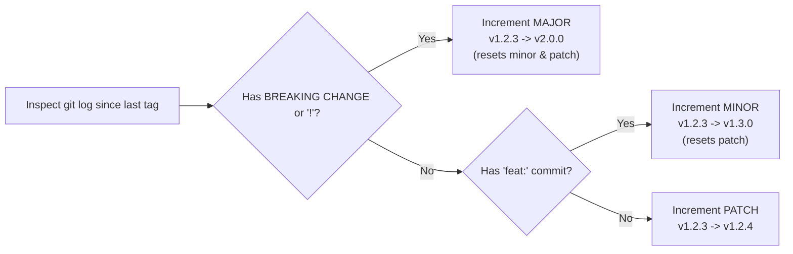

## 🧭 Commonly Used Git Commands

### Branching & Navigation

```bash
# Create and switch to a new branch
git switch -c feat/my-feature

# Switch back to main
git switch main

# List branches with latest commit info
git branch -vv

# Delete merged local branch
git branch -d feat/old-feature

# Delete remote branch
git push origin --delete feat/old-feature
```

### Stashing Changes

```bash
# Stash uncommitted changes with a descriptive label
git stash push -m "wip: halfway through refactor"

# List all stored stashes
git stash list

# Apply and drop the latest stash
git stash pop

# Apply stash without removing it from stack
git stash apply stash@{0}
```

### History, Diffs & Graphs

```bash
# Pretty visual commit tree across all branches
git log --graph --oneline --decorate --all

# View changes currently staged for commit
git diff --staged

# View changes in working tree since last commit
git diff

# Show files changed between two commits or branches
git diff --name-status main..feat/my-feature
```

### Undoing & Rewriting History

```bash
# Soft reset: undo commit but keep changes staged
git reset --soft HEAD~1

# Mixed reset (default): undo commit and unstage changes, keep working files
git reset HEAD~1

# Discard all unstaged changes in working directory
git restore .

# Clean untracked files and directories (dry-run with -n first)
git clean -fd

# Interactive rebase on main (squash, reword, fixup commits)
git rebase -i main

# Cherry-pick a specific commit into current branch
git cherry-pick <commit_sha>
```

### Advanced: Git Worktrees & Bisect

```bash
# Work on multiple branches simultaneously without switching or re-cloning
git worktree add ../feature-worktree feat/new-work
git worktree list
git worktree remove ../feature-worktree

# Binary search to identify the commit that introduced a regression
git bisect start
git bisect bad                 # Current commit is broken
git bisect good v1.0.0         # v1.0.0 was known to be working
# (test, then mark 'git bisect good' or 'git bisect bad')
git bisect reset
```

---

## 🏷️ How to Version Tags Based on Commit Messages

Semantic Versioning follows the format **`v<MAJOR>.<MINOR>.<PATCH>`**:



### Commit Types & Tag Increment Mapping

| Commit Type / Syntax                      | SemVer Impact | Rule                                                                     | Example Transition              |
| :---------------------------------------- | :-----------: | :----------------------------------------------------------------------- | :------------------------------ |
| **`feat!:`** or footer `BREAKING CHANGE:` |   **MAJOR**   | Incompatible API changes, breaking configuration changes, removed flags. | `v1.2.3` $\rightarrow$ `v2.0.0` |
| **`feat:`** or **`feat(scope):`**         |   **MINOR**   | Backwards-compatible new functionality, new flags, new actions.          | `v1.2.3` $\rightarrow$ `v1.3.0` |
| **`fix:`**, **`fix(scope):`**             |   **PATCH**   | Backwards-compatible bug fixes.                                          | `v1.2.3` $\rightarrow$ `v1.2.4` |
| **`perf:`**                               |   **PATCH**   | Performance improvements without feature change.                         | `v1.2.3` $\rightarrow$ `v1.2.4` |
| **`refactor:`**                           |   **PATCH**   | Code refactoring without behavioral alteration.                          | `v1.2.3` $\rightarrow$ `v1.2.4` |
| **`docs:`**                               |   **PATCH**   | Documentation additions or corrections.                                  | `v1.2.3` $\rightarrow$ `v1.2.4` |
| **`ci:`**                                 |   **PATCH**   | Pipeline updates, GitHub Actions alterations.                            | `v1.2.3` $\rightarrow$ `v1.2.4` |
| **`chore:`**, **`build:`**, **`test:`**   |   **PATCH**   | Tooling, dependencies, testing changes.                                  | `v1.2.3` $\rightarrow$ `v1.2.4` |

---

## 🚀 Practical Release & Tagging Workflows

### 1. In `bum-in-a-box` (`scripts/release.sh`)

[`bum-in-a-box`](https://github.com/bumuellp/bum-in-a-box) includes a dedicated release helper script at [`scripts/release.sh`](https://github.com/bumuellp/bum-in-a-box/blob/main/scripts/release.sh):

```bash
# Inside bum-in-a-box repository:
./scripts/release.sh v1.0.3
```

This helper:

1. Validates strict SemVer syntax (`^v[0-9]+\.[0-9]+\.[0-9]+$`).
2. Confirms working tree is clean and currently on `main`.
3. Checks local and remote origin to prevent accidental tag overwriting.
4. Calls `gh release create` with auto-generated release notes, triggering the automated container build and GHCR deployment workflow.

---

### 2. Manual Tagging Across Other Repositories

For repositories without a custom release script, tag using Git and GitHub CLI:

```bash
# 1. Create an annotated release tag (immutable)
git tag -a v1.3.0 -m "Release v1.3.0"
git push origin v1.3.0

# 2. Fast-forward floating major tag (v1) to track latest release
git tag -f -a v1 -m "Release v1"
git push -f origin v1

# 3. (Optional) Publish GitHub Release via CLI
gh release create v1.3.0 --title "v1.3.0" --generate-notes
```

---

## 🪝 Pre-Commit & Guard Management

```bash
# Install hooks across all git stages (commit, commit-msg, pre-push)
pre-commit install --hook-type pre-commit --hook-type commit-msg --hook-type pre-push

# Run all hooks on all files
pre-commit run --all-files

# Run local act integration tests explicitly
pre-commit run act-integration-test --hook-stage manual
```
