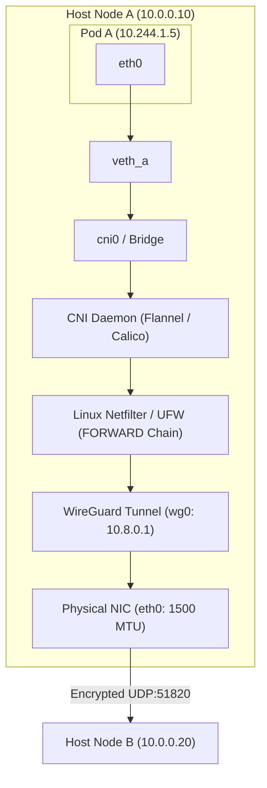

> 🔗 **Related**: [Cheat Sheet: Kubernetes CLI](./kubernetes-cheatsheet.md) · [Runbook: Kubernetes Manifest Validation](./k8s-manifest-validation-runbook.md) · [Runbook: Kubernetes UFW Routing](../linux/k8s-ufw-routing-runbook.md) · [Runbook: WireGuard Routing & Hardening](../linux/wireguard-routing-runbook.md)

Deploying Kubernetes on bare-metal, VPS providers, or hybrid multi-cloud topologies requires routing container traffic across host network namespaces. When host firewalls such as UFW and overlay tunnels such as WireGuard operate concurrently, default networking configurations cause packet drops and silent connection freezes.

---

## 🏛️ Network Flow Architecture

Kubernetes assigns every Pod a routable IP within a cluster CIDR. Pod interfaces connect to the root host network namespace through virtual ethernet (`veth`) pairs attached to a bridge device or routed directly by the Container Network Interface (CNI) daemon:



---

## 🛡️ Host Firewall Boundaries & Forwarding Policies

Linux hosts commonly configure UFW or `iptables` with a default drop policy for transit packets:

```ini
# /etc/default/ufw
DEFAULT_FORWARD_POLICY="DROP"
```

### Why Transit Packets Drop

1. **Intra-node traffic**: Packets between two local pods on the same node cross `cni0`. The Linux kernel passes bridged traffic through the `FORWARD` filter chain. If `DEFAULT_FORWARD_POLICY="DROP"`, the kernel discards the packets unless explicit bridge filtering rules exist.
2. **Inter-node pod traffic**: When a pod transmits to a pod on another node, the local CNI encapsulates the payload (e.g., VXLAN UDP port 8472 or Geneve port 6081) and routes it out the physical or VPN interface.
3. **Return traffic from external networks**: Egress NAT (masquerading) rewrites pod source IPs to the host IP. Return packets must traverse the `FORWARD` chain back into the bridge.

### Targeted Interface Forwarding vs Global Accept

Opening forwarding globally by setting `DEFAULT_FORWARD_POLICY="ACCEPT"` resolves pod routing, but turns the host into an open IP router, violating perimeter security.

The hardened approach preserves `DEFAULT_FORWARD_POLICY="DROP"` globally, adding granular routing allowances strictly between container interfaces in `/etc/ufw/before.rules`:

```text
# Allow traffic across local CNI bridges and tunnel adapters
-A ufw-before-forward -i cni0 -j ACCEPT
-A ufw-before-forward -o cni0 -j ACCEPT
-A ufw-before-forward -i flannel.1 -j ACCEPT
-A ufw-before-forward -o flannel.1 -j ACCEPT
-A ufw-before-forward -i wg0 -j ACCEPT
-A ufw-before-forward -o wg0 -j ACCEPT
```

---

## 📐 Double Encapsulation & MTU Math

Maximum Transmission Unit (MTU) specifies the largest protocol data unit (in bytes) that a network layer can transmit without fragmentation. Standard physical Ethernet enforces an MTU of 1500 bytes.

### The Double-Encapsulation Problem

When Kubernetes nodes communicate across a WireGuard VPN mesh while running a VXLAN-based overlay CNI (such as Flannel or Calico in VXLAN mode), packets undergo double encapsulation:

```text
+-----------------------------------------------------------------------------------------+
| Outer IP (20 B) | WireGuard UDP (8 B) | WireGuard Crypto Overhead (32 B)                 | 60 Bytes (WireGuard IPv4)
+-----------------------------------------------------------------------------------------+
| Outer IP (20 B) | VXLAN UDP (8 B)     | VXLAN Header (8 B) | Inner Ethernet Header (14 B)| 50 Bytes (VXLAN Overlay)
+-----------------------------------------------------------------------------------------+
| Inner Pod IP Header (20 B)            | TCP Header (20 B)  | Pod Payload Data            |
+-----------------------------------------------------------------------------------------+
```

### Overhead Calculations

1. **Standard Physical Frame**: 1500 bytes
2. **WireGuard Layer**:
   - IPv4 outer header: 20 bytes
   - UDP header: 8 bytes
   - WireGuard encapsulation and authentication tag: 32 bytes
   - Total WireGuard overhead: 60 bytes (IPv4) or 80 bytes (IPv6)
   - Host `wg0` MTU: $1500 - 60 = 1440$ bytes (or 1420 bytes for mixed IPv4/IPv6 networks)
3. **CNI Overlay Layer (VXLAN)**:
   - Outer IPv4 header: 20 bytes
   - Outer UDP header (port 8472): 8 bytes
   - VXLAN header: 8 bytes
   - Inner Ethernet frame header (6B dst MAC + 6B src MAC + 2B EtherType): 14 bytes
   - Total VXLAN overhead: $20 + 8 + 8 + 14 = 50$ bytes

If the CNI defaults to assuming an underlying physical interface ($1500 - 50 = 1450$ MTU), but actually routes across `wg0` (1420 MTU), the combined packet requires $1450 + 60 = 1510$ bytes.

Because WireGuard sets the "Don't Fragment" (DF) bit on outer tunnel packets, the host drops oversized packets without routing them.

```text
Available Payload Budget:
  1500 (Physical MTU)
-   60 (WireGuard IPv4 overhead)
-   50 (VXLAN overlay overhead)
-   40 (TCP/IP headers)
= 1350 bytes maximum safe TCP payload (MSS)
```

To guarantee that pod traffic never exceeds tunnel capacity, configure the CNI MTU to 1340 or 1370 bytes depending on your underlying transport:

| Configuration                                                  | WireGuard MTU (`wg0`) | Recommended CNI Overlay MTU |
| :------------------------------------------------------------- | :-------------------- | :-------------------------- |
| **Physical Ethernet (1500 MTU) + VXLAN**                       | None (Direct host)    | 1450                        |
| **WireGuard Mesh + VXLAN (IPv4)**                              | 1440                  | 1390                        |
| **WireGuard Mesh + VXLAN (IPv4/IPv6 Safe)**                    | 1420                  | 1340                        |
| **WireGuard Mesh + Direct Host Routing (Calico BGP/No-Encap)** | 1420                  | 1420                        |

---

## 🔍 Path MTU Discovery & Frozen Handshakes

When an MTU mismatch exists in the path, network behavior exhibits a signature failure pattern:

1. **ICMP `ping` works normally**: Small echo requests (64 bytes) fit comfortably within the reduced MTU.
2. **Short HTTP requests succeed**: Small GET requests and API health checks return status 200.
3. **Large payloads and TLS handshakes freeze**: During TLS negotiation, the server sends its certificate chain (frequently 3 to 6 KB). When packets exceed the MTU threshold, intermediate nodes drop them.
4. **Black Hole phenomenon**: If intermediate firewalls block ICMP "Destination Unreachable / Fragmentation Needed" (Type 3, Code 4) messages, Path MTU Discovery (PMTUD) fails. The client socket hangs indefinitely waiting for TCP acknowledgments.

### Diagnosis & Reproduction Commands

Run these three tests from inside a test pod or across node interfaces to isolate MTU-related hangs:

```bash
# 1. Test ICMP with Don't Fragment (DF) bit set at target packet size (1312 payload + 28 IP/ICMP = 1340)
ping -M do -s 1312 10.244.1.5

# 2. Test short plaintext HTTP request (fits in one small packet, succeeds)
curl -v --connect-timeout 5 http://10.244.1.5:8080/healthz

# 3. Test TLS handshake (server sends multi-kilobyte certificate chain, freezes if MTU exceeded)
openssl s_client -connect 10.244.1.5:443 -servername api.internal.local < /dev/null
```

If a packet size of 1312 succeeds ($1312 + 28 \text{ ICMP/IP headers} = 1340$), but 1400 times out, the path MTU is clamped at 1340 bytes.

---

## 🔗 Related Documentation & Context

- [Cheat Sheet: Kubernetes CLI](./kubernetes-cheatsheet.md)
- [Runbook: Kubernetes Manifest Validation](./k8s-manifest-validation-runbook.md)
- [Runbook: Kubernetes UFW Routing](../linux/k8s-ufw-routing-runbook.md)
- [Runbook: WireGuard Routing & Hardening](../linux/wireguard-routing-runbook.md)
