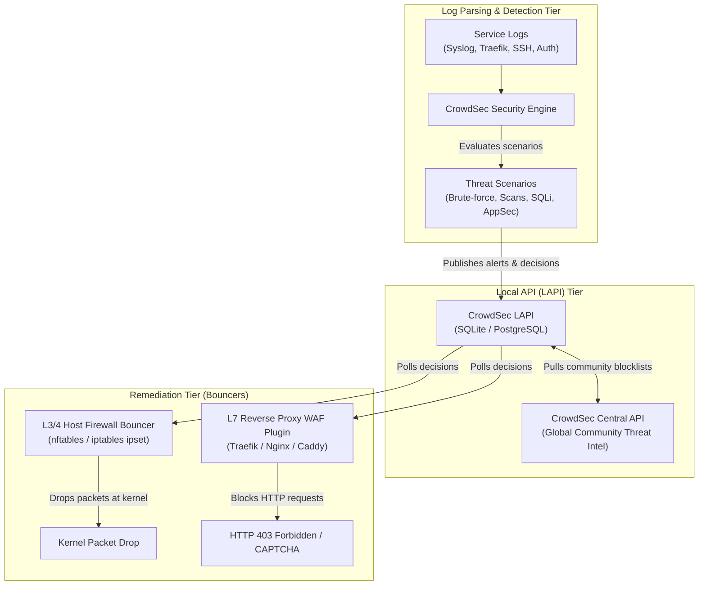

> 🔗 **Related**: [Cheat Sheet: CrowdSec CLI (cscli)](./crowdsec-cheatsheet.md) · [Runbook: CrowdSec Operations & Triage](./crowdsec-operations-runbook.md) · [Cheat Sheet: UFW Firewall](../linux/ufw-cheatsheet.md)

CrowdSec operates as a collaborative intrusion detection and prevention system (IDS/IPS). By decoupling log acquisition and behavioral detection from remediation enforcement, it coordinates defense across kernel firewalls, reverse proxies, and global threat intelligence.

---

## 🏛️ System Architecture

---

## 🔍 The Three Architecture Tiers

### 1. Detection Tier: Parsers & Behavioral Scenarios

The Security Engine ingests unstructured log streams from local files, journald, or remote syslog sockets:

1. **Parsers**: Normalizes raw log lines into structured event objects using Grok patterns (extracting source IP, timestamp, user agent, requested URI, and status code).
2. **Scenarios (Leaky Buckets)**: Implements stateful detection rules. When a source IP exceeds a defined event threshold within a sliding time window (e.g. 5 failed SSH logins in 30 seconds), the scenario triggers an alert.
3. **AppSec Component**: Evaluates HTTP request bodies and query parameters in-flight before the reverse proxy forwards the request to downstream applications.

---

### 2. Coordination Tier: Local API (LAPI) & Central API (CAPI)

- **Local API (LAPI)**: Operates as the central state store for a cluster or host. It persists active remediation decisions into SQLite or PostgreSQL, serves bouncer polling requests, and deduplicates alerts.
- **Central API (CAPI)**: An upstream intelligence bridge that shares anonymized attack signals with the CrowdSec community consensus network. In return, CAPI distributes curated global blocklists to protect instances against known malicious scanners before they ever touch your host.

---

### 3. Remediation Tier: Bouncers (L3/4 vs L7)

Decisions made by LAPI are enforced by lightweight bouncer daemons or plugins:

| Remediation Dimension  | Layer 3/4 Host Firewall Bouncer                       | Layer 7 Reverse Proxy WAF Plugin                 |
| :--------------------- | :---------------------------------------------------- | :----------------------------------------------- |
| **Component**          | `crowdsec-firewall-bouncer`                           | `crowdsec-bouncer-traefik-plugin`                |
| **Implementation**     | Linux kernel `nftables` or `ipset`                    | Reverse proxy middleware (Traefik, Nginx, Caddy) |
| **Inspection Scope**   | Source IP, destination port, transport protocol       | HTTP method, headers, URIs, cookies, payloads    |
| **Action**             | Immediate kernel packet drop (TCP RST or DROP)        | `HTTP 403 Forbidden` or interactive CAPTCHA      |
| **Resource Overhead**  | Near-zero CPU overhead; handled entirely by Netfilter | Microsecond HTTP pipeline evaluation             |
| **Protected Services** | SSH, WireGuard, database listeners, raw TCP/UDP       | Web applications, APIs, administrative panels    |
| **Virtual Patching**   | Cannot inspect application payloads                   | Blocks CVE probes, SQLi, and path traversal      |

---

## ⚖️ Defense-in-Depth Strategy

A comprehensive homelab or enterprise deployment combines both bouncer layers:

1. **Perimeter Dropping (L3/4)**: Drops distributed SSH brute-forcers, port scanners, and CAPI community blocklist IPs at the network interface before sockets are allocated.
2. **Application Protection (L7)**: Inspects valid HTTP traffic passing through reverse proxies, blocking exploit attempts against services such as Nextcloud, Home Assistant, or Vaultwarden with custom error pages.

---

## 🔗 Related Documentation & Context

- [Cheat Sheet: CrowdSec CLI (cscli)](./crowdsec-cheatsheet.md)
- [Runbook: CrowdSec Operations & Triage](./crowdsec-operations-runbook.md)
- [Cheat Sheet: UFW Firewall](../linux/ufw-cheatsheet.md)
- [Runbook: Docker UFW Routing](../linux/docker-ufw-runbook.md)
- [Runbook: Kubernetes UFW Routing](../linux/k8s-ufw-routing-runbook.md)
- [CrowdSec Official Documentation](https://docs.crowdsec.net/)
