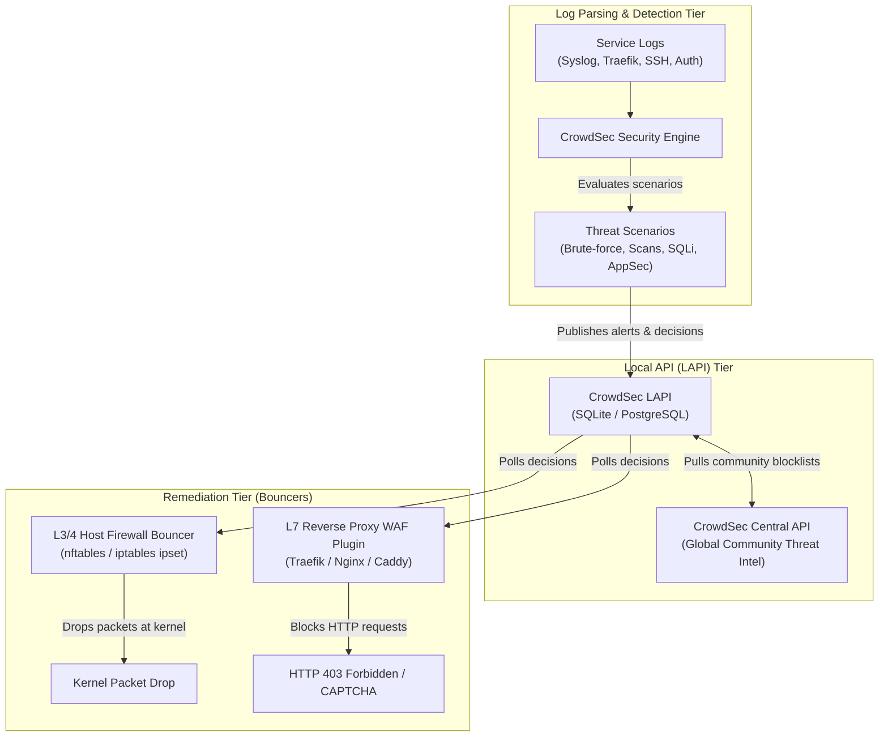

CrowdSec is an open-source, collaborative intrusion detection and prevention system. It detects threats through log parsing and behavioral scenarios, and enforces remediation (dropping packets, returning 403 Forbidden, or displaying CAPTCHAs) via decentralized bouncers.



---

## 🎛️ Essential `cscli` Commands

### 1. Decisions & Remediation

```bash
# List all active IP bans and remediation decisions
cscli decisions list

# Manually ban an IP address for 24 hours with a reason
cscli decisions add --ip 198.51.100.42 --duration 24h --reason "Manual ban for port scanning"

# Manually ban an entire subnet (CIDR block)
cscli decisions add --range 198.51.100.0/24 --duration 48h --reason "Suspicious subnet"

# Delete a ban / unban an IP address
cscli decisions delete --ip 198.51.100.42

# Delete a ban by decision ID
cscli decisions delete --id 1234
```

### 2. Alerts & Forensics

```bash
# List recent alerts with scenario names, IP origins, and timestamps
cscli alerts list --limit 50

# Inspect detailed forensic data of a specific alert
cscli alerts inspect 1234

# View real-time security engine performance metrics and parsed line counters
cscli metrics
```

### 3. Bouncers & Machines

```bash
# List all registered bouncers and their last poll timestamps
cscli bouncers list

# Register a new firewall bouncer and generate an API key
cscli bouncers add host-firewall-bouncer

# Delete an inactive bouncer
cscli bouncers delete host-firewall-bouncer

# List registered local machine agents
cscli machines list
```

### 4. Hub Management (Collections & Scenarios)

```bash
# Update local Hub index from CrowdSec registry
cscli hub update

# Upgrade all installed parsers, scenarios, and collections
cscli hub upgrade

# List installed collections
cscli collections list

# Install core collections for Linux host protection and reverse proxies
cscli collections install crowdsecurity/linux
cscli collections install crowdsecurity/sshd
cscli collections install crowdsecurity/traefik
cscli collections install crowdsecurity/appsec-virtual-patching
```

---

## 🛡️ Remediation Architecture: Layer 3/4 vs Layer 7

### Layer 3/4: Host Firewall Bouncer (`crowdsec-firewall-bouncer`)

- **Mechanism**: Injects banned IPs directly into Linux kernel `ipset` or `nftables` sets.
- **Effect**: Drops malicious packets before they reach user-space applications (protects SSH, WireGuard, and raw TCP ports).
- **High Efficiency**: Zero CPU overhead in user space; dropped instantly at the network interface layer.

### Layer 7: Reverse Proxy WAF Plugin (`crowdsec-bouncer-traefik-plugin`)

- **Mechanism**: Runs inside Traefik / reverse proxy as a middleware plugin communicating with LAPI.
- **Effect**: Inspects HTTP requests, URI query parameters, and request bodies for web attacks (SQL injection, XSS, path traversal).
- **AppSec Virtual Patching**: Blocks known CVE exploits before reaching backend containers with standard `403 Forbidden` responses.

---

## 🧪 Testing, Health Checks & Verification

For official detection checks, see the [CrowdSec Health Check Documentation](https://docs.crowdsec.net/u/getting_started/health_check/).

### 1. Health & Status Checks

```bash
# Verify Local API (LAPI) health endpoint
curl -s http://127.0.0.1:8080/v1/health

# Check Central API (CAPI) upstream synchronization
cscli capi status

# Check Cloud Console connection status
cscli console status
```

### 2. Log Parsing Simulation via `cscli explain` (Zero Risk)

Verify that parsers and scenarios trigger correctly against simulated log lines without sending live malicious traffic:

```bash
# Test Web / Nginx sensitive path probe (.env probing)
cscli explain --type nginx \
  --log '198.51.100.25 - - [09/Sep/2026:12:00:00 +0000] "GET /.env HTTP/1.1" 404 153 "-" "curl/7.68.0"'

# Test Bad User-Agent scanner detection
cscli explain --type nginx \
  --log '198.51.100.25 - - [09/Sep/2026:12:00:00 +0000] "GET / HTTP/1.1" 200 1200 "-" "Nikto"'

# Test SSH failed authentication
cscli explain --type syslog \
  --log 'Sep 09 12:00:00 ubuntu sshd[12345]: Failed password for invalid user admin from 198.51.100.25 port 54321 ssh2'
```

### 3. Verification with Live Simulated Decision

```bash
# Add a temporary 5-minute ban for a test IP
cscli decisions add --ip 198.51.100.42 --duration 5m --reason "manual-test"

# Verify host firewall bouncer added IP to kernel ipset / iptables
sudo iptables -L CROWDSEC_CHAIN -v -n
# or verify with ipset directly:
sudo ipset test crowdsec-blacklists-4 198.51.100.42

# Test HTTP block through reverse proxy
curl -I -H "X-Forwarded-For: 198.51.100.42" https://service.example.com

# Clean up test ban
cscli decisions delete --ip 198.51.100.42
```

---

## 🩺 Troubleshooting & Operational Diagnostics

### 1. Permission Denied on Host Log Files (Rootless Containers)

- **Symptom**: CrowdSec container logs show `permission denied` reading host log files (`auth.log`, `syslog`, `ufw.log`, or `kern.log`).
- **Cause**: In rootless container engines (e.g. rootless Podman), the engine runs under an unprivileged host UID. System logs on Debian/Ubuntu are restricted to `root:adm (0640)`.
- **Remediation**: Use POSIX Access Control Lists (ACLs) to grant the container host user read permissions without weakening global file masks:

  ```bash
  sudo apt-get install -y acl
  # Grant read permission on active log files
  sudo setfacl -m u:$USER:r /var/log/auth.log /var/log/syslog /var/log/ufw.log /var/log/kern.log
  # Ensure future rotated logs inherit read permissions
  sudo setfacl -d -m u:$USER:r /var/log
  ```

### 2. Duplicate / Stale Bouncer Aliases (`FIREWALL@10.89.x.x`)

- **Symptom**: `cscli bouncers list` displays multiple duplicate entries with bridge socket IP suffixes after container restarts.
- **Cause**: Container networks dynamically assign new bridge socket IPs upon restarting, prompting LAPI to register new client aliases under the same API token.
- **Remediation**: Prune inactive bouncers that have not polled within the last 10 minutes:

  ```bash
  cscli bouncers prune -d 10m
  # Or manually remove a specific stale bouncer:
  cscli bouncers delete <BOUNCER_NAME>
  ```

### 3. Acquisition Metrics Missing in `cscli metrics`

- **Symptom**: Configured log files or journal sources do not appear in the `Acquisition Metrics` table.
- **Cause**: CrowdSec acquisition metrics are in-memory and reset upon daemon restart. CrowdSec omits log sources from the metrics summary until at least 1 new log line has been ingested.
- **Remediation**: Trigger a test log line (e.g., generate an SSH connection attempt or web request) and re-run `cscli metrics`.

### 4. Bouncer Cannot Connect to Local API (`127.0.0.1:8080`)

- **Symptom**: Firewall bouncer log displays `connection refused` or `401 Unauthorized` when calling LAPI.
- **Remediation**:
  1. Verify the CrowdSec container or service is actively listening on `:8080`.
  2. Confirm the API token in `/etc/crowdsec/bouncers/crowdsec-firewall-bouncer.yaml` exactly matches the key registered in `cscli bouncers list`.
  3. Re-register the bouncer if necessary:

     ```bash
     cscli bouncers add host-firewall --key <GENERATED_KEY>
     sudo systemctl restart crowdsec-firewall-bouncer
     ```

### 5. Rootless Low-Port Binding Restrictions (Ports < 1024)

- **Symptom**: Port forwarding fails with `bind: permission denied` for ports `80`, `443`, or `22`.
- **Remediation**: Lower the kernel unprivileged port start range:

  ```bash
  echo "net.ipv4.ip_unprivileged_port_start=22" | sudo tee /etc/sysctl.d/50-unprivileged-ports.conf
  sudo sysctl --system
  ```

### 6. AppSec Resolver / Internal DNS Failures

- **Symptom**: Reverse proxy logs report `Security engine connection failed: crowdsec could not be resolved` or `recv() failed (111: Connection refused) while resolving`.
- **Cause**: In rootless container bridges (like Netavark), DNS is hosted on the bridge gateway (`10.89.0.1:53`), whereas Docker uses `127.0.0.11:53`. Public DNS upstreams will fail to resolve internal container hostnames.
- **Remediation**: Configure your proxy's internal DNS resolver to target the local container bridge gateway (e.g., `resolver 10.89.0.1 valid=30s ipv6=off;`) or route directly to the static container IP on the internal network.
