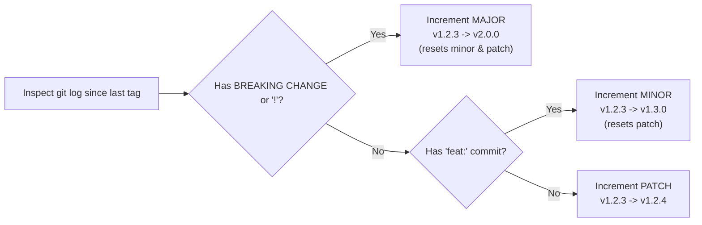

> 🔗 **Related**: [Cheat Sheet: Git CLI](./git-cheatsheet.md) · [Cheat Sheet: GitHub CLI (gh)](./gh-cheatsheet.md) · [Cheat Sheet: GitHub Actions CI/CD](./github-actions-cheatsheet.md)

This runbook provides a disciplined procedure for calculating Semantic Versioning (SemVer) tags from Conventional Commit histories, generating immutable release tags, advancing floating major tags (`@v1`), and publishing releases via GitHub CLI.

---

## 📋 Prerequisites & Requirements

Before starting this procedure, ensure the following conditions are met:

- [ ] Local git repository on the `main` branch with a clean working tree (`git status`)
- [ ] GitHub CLI (`gh`) authenticated with repository permissions (`gh auth status`)
- [ ] Git push access to remote `origin`

---

## 📐 Semantic Versioning & Commit Mapping

Semantic Versioning strictly follows the format **`v<MAJOR>.<MINOR>.<PATCH>`**:



### Commit Types & Version Increment Mapping

| Commit Type / Header                      | SemVer Impact | Rule                                                                     | Example Transition              |
| :---------------------------------------- | :-----------: | :----------------------------------------------------------------------- | :------------------------------ |
| **`feat!:`** or footer `BREAKING CHANGE:` |   **MAJOR**   | Incompatible API alterations, breaking config schemas, removed commands. | `v1.2.3` $\rightarrow$ `v2.0.0` |
| **`feat:`** or **`feat(scope):`**         |   **MINOR**   | Backwards-compatible new features, capabilities, or workflow inputs.     | `v1.2.3` $\rightarrow$ `v1.3.0` |
| **`fix:`**, **`fix(scope):`**             |   **PATCH**   | Backwards-compatible bug fixes.                                          | `v1.2.3` $\rightarrow$ `v1.2.4` |
| **`perf:`**                               |   **PATCH**   | Performance improvements without feature modification.                   | `v1.2.3` $\rightarrow$ `v1.2.4` |
| **`refactor:`**                           |   **PATCH**   | Code restructuring without behavioral alterations.                       | `v1.2.3` $\rightarrow$ `v1.2.4` |
| **`docs:`**                               |   **PATCH**   | Documentation additions, corrections, and typos.                         | `v1.2.3` $\rightarrow$ `v1.2.4` |
| **`ci:`**                                 |   **PATCH**   | Pipeline updates and GitHub Actions modifications.                       | `v1.2.3` $\rightarrow$ `v1.2.4` |
| **`chore:`**, **`build:`**, **`test:`**   |   **PATCH**   | Tooling updates, dependency bumps, test suite additions.                 | `v1.2.3` $\rightarrow$ `v1.2.4` |

---

## 🚀 Step-by-Step Release Procedures

### Procedure 1: Automated Release in `bum-in-a-box`

Repositories utilizing the dedicated release helper script execute:

```bash
# Verify working tree and publish release tag
./scripts/release.sh v1.0.3
```

The script executes the following checks automatically:

1. Validates strict SemVer syntax (`^v[0-9]+\.[0-9]+\.[0-9]+$`).
2. Confirms working tree is clean and currently on `main`.
3. Checks local and remote origin to prevent accidental tag overwriting.
4. Invokes `gh release create` with auto-generated release notes, triggering container builds on GHCR.

---

### Procedure 2: Standard Manual Release Workflow

For repositories without custom scripts, follow these three steps:

#### Step 1: Inspect Changes Since Last Release

```bash
# Find latest tag
LATEST_TAG=$(git describe --tags --abbrev=0)

# Review all commit subjects since that tag
git log ${LATEST_TAG}..HEAD --oneline
```

Determine the target version based on the commit types listed.

#### Step 2: Create and Push the Immutable SemVer Tag

Always create an **annotated tag** (`-a`) rather than a lightweight tag to record the tagger, timestamp, and release message:

```bash
# Tag the current HEAD
git tag -a v1.3.0 -m "Release v1.3.0"

# Push tag to remote
git push origin v1.3.0
```

#### Step 3: Advance Floating Major Tag (For GitHub Actions & Shared Repos)

If the repository hosts reusable workflows or composite actions, advance the floating major tag (`v1`) so downstream callers receive updates automatically:

```bash
# Point floating major tag to current commit
git tag -f -a v1 -m "Release v1"

# Force push floating tag to origin
git push -f origin v1
```

#### Step 4: Publish GitHub Release Notes via CLI

Generate release notes and publish the release entry on GitHub:

```bash
gh release create v1.3.0 --title "v1.3.0" --generate-notes
```

---

## 🛡️ Tag Immutability & Supply Chain Protection

Overwriting SemVer release tags (e.g. force-pushing `v1.3.0`) breaks downstream builds and introduces supply-chain drift.

Install the `tag-immutability-guard` hook from `cabumtain-hook` in your `.pre-commit-config.yaml` to block accidental tag modifications:

```yaml
- repo: https://github.com/bumuellp/cabumtain-hook
  rev: v1.3.0
  hooks:
    - id: tag-immutability-guard
      stages: [pre-push]
```

---

## ✅ Verification

Confirm both tags exist and point to the correct commit:

```bash
# Verify tag references
git show-ref --tags

# Verify GitHub release state
gh release view v1.3.0
```

---

## 🔗 Related Documentation & Context

- [Cheat Sheet: Git CLI](./git-cheatsheet.md)
- [Cheat Sheet: GitHub CLI (gh)](./gh-cheatsheet.md)
- [Cheat Sheet: GitHub Actions CI/CD](./github-actions-cheatsheet.md)
- [Cheat Sheet: Pre-Commit Framework](./pre-commit-cheatsheet.md)
